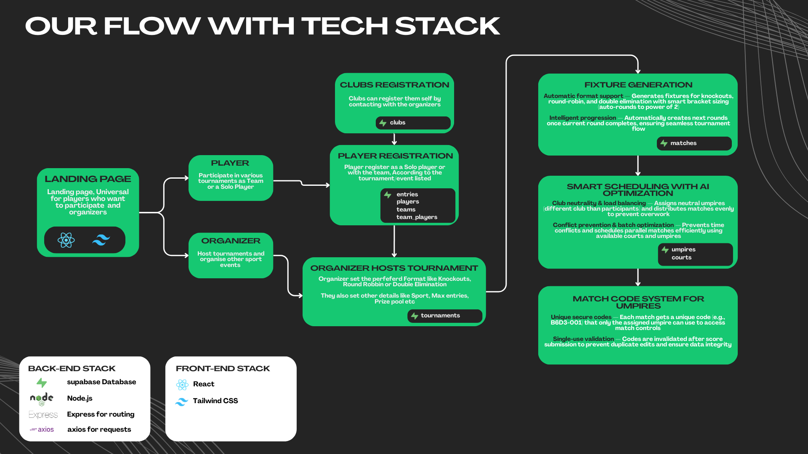
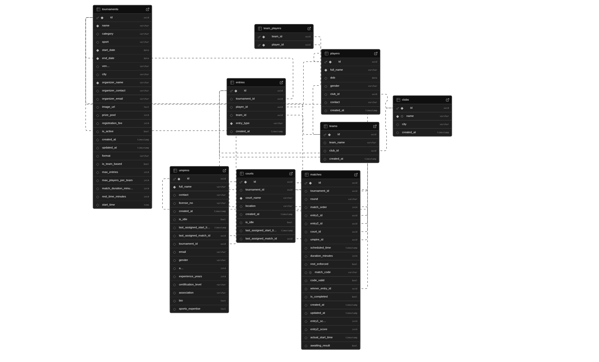

# BracketFlow - Sports Tournament Management Platform

A comprehensive tournament management system designed for Indian sports organizers, featuring automated fixture generation, intelligent scheduling, and real-time match management. Built with modern web technologies to streamline tournament operations from registration to completion.

> **✅ Deliverables Status:** All required deliverables have been achieved in the deployed version. Additionally, several extra features have been implemented to enhance the platform's functionality and user experience.

## 🚀 Live Deployment

The platform is live and accessible at: **[https://sprintx-hackathon-bracket-flow.vercel.app/](https://sprintx-hackathon-bracket-flow.vercel.app/)**

## 📹 Demo Video

Watch the complete platform walkthrough and demonstration: **[Demo Video](https://drive.google.com/file/d/1emJ1-rC1E77p-JDUR1BSqykuvC0ho54Q/view?usp=sharing)**

The demo video includes:
- Platform overview and features
- Database schema explanation
- User flows for organizers, players, and umpires
- Live demonstrations of key functionalities

## 🛠️ Tech Stack

### Frontend
- **React 18** - Modern UI library with hooks
- **TypeScript** - Type-safe development
- **Vite** - Fast build tool and dev server
- **Tailwind CSS** - Utility-first CSS framework
- **shadcn/ui** - High-quality React components
- **Framer Motion** - Smooth animations and transitions
- **TanStack Query** - Powerful data synchronization
- **React Router** - Client-side routing

### Backend & Database
- **Supabase** - PostgreSQL database with real-time capabilities
- **Supabase JS Client** - Type-safe database client

### Additional Libraries
- **React Brackets** - Tournament bracket visualization
- **Recharts** - Data visualization for leaderboards
- **Zod** - Schema validation
- **React Hook Form** - Form management
- **date-fns** - Date manipulation utilities



## 🗄️ Database Schema

The platform uses a comprehensive PostgreSQL database schema managed through Supabase. The database includes tables for tournaments, matches, players, teams, clubs, umpires, courts, and entries with proper relationships and constraints.

A detailed explanation of the database schema is available in the [demo video](https://drive.google.com/file/d/1emJ1-rC1E77p-JDUR1BSqykuvC0ho54Q/view?usp=sharing).



## 📚 Documentation

Detailed technical documentation explaining the core algorithms and system architecture is available in the `docs/` folder:

- **[Fixture Logic](./docs/FIXTURE_LOGIC.md)** - Comprehensive guide on how fixtures are generated for different tournament formats (Knockouts, Round Robin, Double Elimination)
- **[Scheduling Logic](./docs/SCHEDULING_LOGIC.md)** - Detailed explanation of the AI-optimized scheduling algorithm including court assignment, umpire assignment, conflict prevention, and load balancing
- **[Match Code Flow](./docs/MATCH_CODE_FLOW.md)** - Complete documentation on the secure match code system for umpires
- **[Vercel Deployment](./docs/VERCEL_DEPLOYMENT.md)** - Deployment guide and configuration

### Key Features Documented

#### Fixture Generation
- **Automatic format support** - Generates fixtures for knockouts, round-robin, and double elimination with smart bracket sizing (auto-rounds to power of 2)
- **Intelligent progression** - Automatically creates next rounds once current round completes, ensuring seamless tournament flow

#### Smart Scheduling WITH AI OPTIMIZATION
- **Club neutrality & load balancing** - Assigns neutral umpires (different club than participants) and distributes matches evenly to prevent overwork
- **Conflict prevention & batch optimization** - Prevents time conflicts and schedules parallel matches efficiently using available courts and umpires

#### Match Code System for Umpires
- **Unique secure codes** - Each match gets a unique code (e.g., `B6D3-001`) that only the assigned umpire can use to access match controls
- **Single-use validation** - Codes are invalidated after score submission to prevent duplicate edits and ensure data integrity

## 🎯 Key Features

### For Organizers
- **Tournament Creation** - Create tournaments with customizable formats, dates, venues, and prize pools
- **Unified Control Booth** - Monitor brackets, venues, assignments, and contingencies from a single dashboard
- **Automated Fixture Generation** - Auto-build brackets and match grids with intelligent scheduling
- **Resource Management** - Assign courts and umpires with conflict prevention
- **Real-time Monitoring** - Track match progress, umpire workload, and court utilization

### For Players
- **Tournament Discovery** - Search and filter tournaments by sport, city, date, prize pool, and more
- **Easy Registration** - Register individually or as a team with a streamlined process
- **Live Standings** - View real-time scores, rankings, and tournament progress
- **Bracket Visualization** - Interactive tournament brackets showing match progression

### For Umpires
- **Match Code System** - Secure access to assigned matches using unique codes
- **Live Scoring Interface** - Enter scores, manage match timers, and handle disqualifications
- **Match Management** - Start matches, track time, and submit results with validation

### Additional Features
- **AI-Supported Scheduling** - Automated scheduling that respects rest rules, surfaces, and travel blocks
- **Event Health Insights** - Surface workload, fatigue, and weather alerts
- **Weather Integration** - Real-time weather data and alerts for outdoor tournaments
- **Responsive Design** - Fully responsive UI that works on all devices

## 🚀 Local Development Setup

### Prerequisites
- **Node.js** (v18 or higher recommended)
- **npm** or **yarn** or **bun** package manager
- **Supabase Account** - For database access

### Installation Steps

1. **Clone the repository**
   ```bash
   git clone <repository-url>
   cd bracketflow_project
   ```

2. **Install dependencies**
   ```bash
   npm install
   # or
   yarn install
   # or
   bun install
   ```

3. **Set up environment variables**
   
   Create a `.env` file in the root directory:
   ```env
   VITE_SUPABASE_URL=your_supabase_project_url
   VITE_SUPABASE_ANON_KEY=your_supabase_anon_key
   VITE_ORGANIZER_PASSKEY=pass123456
   ```
   
   - You can find the Supabase values in your Supabase project settings under API.
   - `VITE_ORGANIZER_PASSKEY` is the password for the organizer portal login (username: `Xthlete`).

4. **Run database migrations** (if applicable)
   
   The `migrations/` folder contains SQL migration files. Run these in your Supabase SQL editor to set up the database schema.

5. **Start the development server**
   ```bash
   npm run dev
   # or
   yarn dev
   # or
   bun dev
   ```

   The application will be available at `http://localhost:8080` (or the port specified in `vite.config.ts`)

### Available Scripts

- `npm run dev` - Start the development server with hot reload
- `npm run build` - Build the production bundle
- `npm run build:dev` - Build in development mode
- `npm run preview` - Preview the production build locally
- `npm run lint` - Run ESLint across the project

## 🏗️ Project Structure

```
├── src/
│   ├── components/       # React components
│   │   ├── ui/          # shadcn/ui components
│   │   └── features/    # Feature-specific components
│   ├── pages/           # Page components (routes)
│   ├── services/        # API service functions
│   ├── types/           # TypeScript type definitions
│   ├── utils/           # Utility functions
│   ├── contexts/        # React contexts (Auth, etc.)
│   └── lib/             # Library configurations
├── public/              # Static assets
├── docs/                # Technical documentation
├── migrations/          # Database migration SQL files
└── dist/                # Production build output
```

## 🔐 Authentication

The platform uses a simple authentication system for organizers:
- Organizers can log in through the `/host/login` route
- Authentication state is managed via React Context
- Protected routes require authentication

## 🎨 UI Components

The project uses **shadcn/ui** components built on Radix UI primitives, providing:
- Accessible components out of the box
- Customizable styling with Tailwind CSS
- Dark mode support
- Responsive design patterns

## 📱 Responsive Design

The platform is fully responsive and optimized for:
- Desktop (1920px+)
- Laptop (1024px - 1920px)
- Tablet (768px - 1024px)
- Mobile (320px - 768px)

## 🚢 Deployment

The project is configured for deployment on Vercel. See [VERCEL_DEPLOYMENT.md](./docs/VERCEL_DEPLOYMENT.md) for detailed deployment instructions.

### Quick Deploy to Vercel

1. Push your code to GitHub
2. Import the repository in Vercel
3. Add environment variables in Vercel dashboard
4. Deploy!

## 🤝 Contributing

Thanks to SprintX Hackathon for giving me this opportunity :)

## 🚀 Future Features

The following features are planned for future releases:

1. **Club Registration Portal** - A dedicated portal for clubs to register and manage their teams and players directly through the platform.

2. **Multi-Event Registration** - Players will be able to register for multiple events (U18, Singles, Doubles) under the same tournament with a streamlined registration process.

3. **Automatic Schedule Adjustment** - Intelligent rescheduling system that automatically adjusts match schedules in case of weather obstructions or other unforeseen circumstances, ensuring minimal disruption to tournament flow.

4. **Automated Match Code Delivery** - Match codes will be automatically sent directly to umpire phone numbers via SMS when match fixtures are generated, eliminating manual communication overhead.

## 🙏 Acknowledgments

- Built for Indian sports organizers and tournament management
- Designed to handle multiple tournament formats and scales
- Optimized for real-world tournament operations

---

**Built with ❤️ for the sports community**

